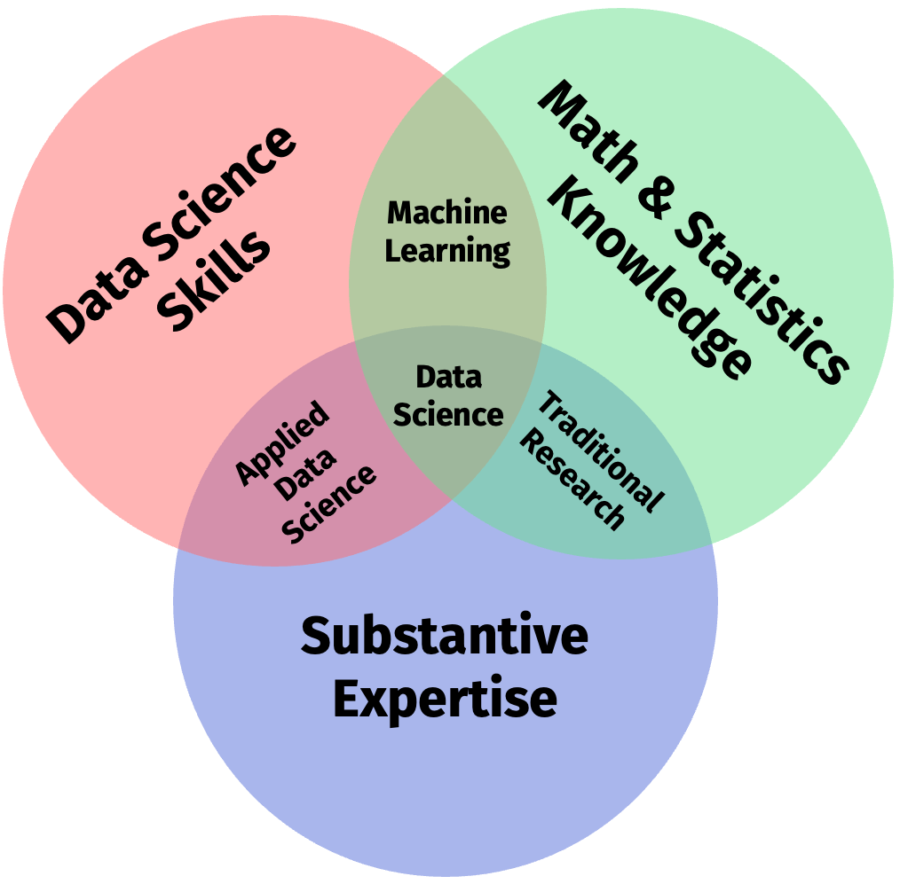
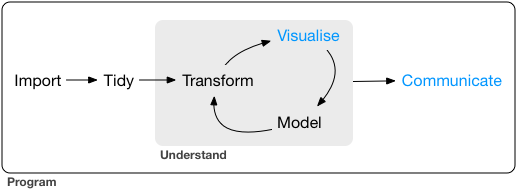
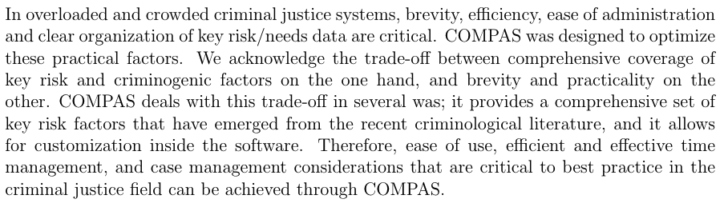
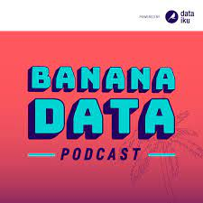

```{css, echo=FALSE} 
@media print { # print out incremental slides; see https://stackoverflow.com/questions/56373198/get-xaringan-incremental-animations-to-print-to-pdf/56374619#56374619
  .has-continuation {
    display: block !important;
  }
}
```

```{r setup, include=FALSE}
# figures formatting setup
options(htmltools.dir.version = FALSE)
library(knitr)
opts_chunk$set(
  prompt = T,
  fig.align="center", #fig.width=6, fig.height=4.5, 
  # out.width="748px", #out.length="520.75px",
  dpi=300, #fig.path='Figs/',
  cache=T, #echo=F, warning=F, message=F
  engine.opts = list(bash = "-l")
  )

## Next hook based on this SO answer: https://stackoverflow.com/a/39025054
knit_hooks$set(
  prompt = function(before, options, envir) {
    options(
      prompt = if (options$engine %in% c('sh','bash')) '$ ' else 'R> ',
      continue = if (options$engine %in% c('sh','bash')) '$ ' else '+ '
      )
})

library(tidyverse)
library(hrbrthemes)
library(fontawesome)
```


# Table of contents

</br></br>

1. [What is data science?](#whatisdatascience)

2. [The data science pipeline](#datasciencepipeline)

3. [Data science for public policy](#science)

4. [Further reading](#furtherreading)


---
class: inverse, center, middle
name: whatisdatascience

# What is data science?
<html><div style='float:left'></div><hr color='#EB811B' size=1px style="width:1000px; margin:auto;"/></html>

---
# What is data science?

.pull-left[
## What is data science?

> "Data science is an interdisciplinary academic field that uses statistics, scientific computing, scientific methods, processes, algorithms and systems to extract or extrapolate knowledge and insights from potentially noisy, structured, or unstructured data." - [Wikipedia](https://en.wikipedia.org/wiki/Data_science)

> "Data science is a concept to unify statistics, data analysis, informatics, and their related methods to understand and analyze actual phenomena with data." - [Chikio Hayashi](https://www.springer.com/book/9784431702085)

Overall, there's **no consensus** - it is a buzzword after all. We're going to carry on with Conway's working definition.
]

.pull-right[
## A working definition

<div align="center"><br>

</div>

`Source` [Drew Conway, 2010](https://drewconway.com/zia/2013/3/26/the-data-science-venn-diagram) (adapted)
]


---
# Types of data-driven research and their role for policy

.pull-left-small2[
## 1. Description
- What is the state of the world?
- What are the trends over time?
- What are the differences between groups?

## The value for policy-making
- At the center of **monitoring**
- "How many people consume misinformation online?"
- "How many people are unemployed in a certain district?"
- "How does the distribution of income vary across educational segments of the population?"
]

--

.pull-left-small2[
## 2. Explanation
- What is the effect of a policy?
- Does the effect vary across groups?
- What are the mechanisms behind the effect?

## The value for policy-making
- At the center of **evaluation**
- "Did the minimum wage increase lead to a decrease in employment?"
- "Did the campaign affect the exposure to misinformation differently across groups?"
- "Why did the intervention not lead to the expected results?"
]

--

.pull-left-small2[
## 3. Prediction
- What is the path of an indicator?
- (When) will future events happen?
- What class does this observation most likely belong to?


## The value for policy-making
- At the center of **forecasting** but also **targeting** and **measurement**
- "Will there be conflict?"
- "How many people will be unemployed in a certain district next year?"
- "Which individuals are most likely to be affected by a policy?"
]


---
class: inverse, center, middle
name: datasciencepipeline

# The data science pipeline
<html><div style='float:left'></div><hr color='#EB811B' size=1px style="width:1000px; margin:auto;"/></html>


---
background-image: url("../pics/vintage-pipeline.jpeg")
background-size: contain
background-color: #000000

# The data science pipeline


---
# The data science pipeline

.pull-left[

**Preparatory work**

- **Problem definition** predict, infer, describe
- **Design** conceptualize, build data collection device
- **Data collection** recruit, collect, monitor

]

---
# The data science pipeline

.pull-left[
**Preparatory work**

- **Problem definition** predict, infer, describe
- **Design** conceptualize, build data collection device
- **Data collection** recruit, collect, monitor

**Data operation**
]

.pull-right-center[
<br><br><br>
<div align="center">

</div>

`Source` [H. Wickham, M. Çetinkaya-Rundel, G. Gronemund: R for Data Science](https://r4ds.hadley.nz/)
]

---
# The data science pipeline

.pull-left[
**Preparatory work**

  - **Problem definition** predict, infer, describe
  - **Design** conceptualize, build data collection device
  - **Data collection** recruit, collect, monitor

**Data operation**

   - **Wrangle**: import, tidy, manipulate
]

.pull-right-center[
<br><br><br>
<div align="center">

</div>

`Source` [H. Wickham, M. Çetinkaya-Rundel, G. Gronemund: R for Data Science](https://r4ds.hadley.nz/)
]


---
# The data science pipeline

.pull-left[
**Preparatory work**

  - **Problem definition** predict, infer, describe
  - **Design** conceptualize, build data collection device
  - **Data collection** recruit, collect, monitor

**Data operation**

   - **Wrangle**: import, tidy, manipulate
   - **Explore**: visualize, describe, discover
]

.pull-right-center[
<br><br><br>
<div align="center">

</div>

`Source` [H. Wickham, M. Çetinkaya-Rundel, G. Gronemund: R for Data Science](https://r4ds.hadley.nz/)
]


---
# The data science pipeline

.pull-left[
**Preparatory work**

  - **Problem definition** predict, infer, describe
  - **Design** conceptualize, build data collection device
  - **Data collection** recruit, collect, monitor

**Data operation**

   - **Wrangle**: import, tidy, manipulate
   - **Explore**: visualize, describe, discover
   - **Model**: build, test, infer, predict
]

.pull-right-center[
<br><br><br>
<div align="center">

</div>

`Source` [H. Wickham, M. Çetinkaya-Rundel, G. Gronemund: R for Data Science](https://r4ds.hadley.nz/)
]


---
# The data science pipeline

.pull-left[
**Preparatory work**

  - **Problem definition** predict, infer, describe
  - **Design** conceptualize, build data collection device
  - **Data collection** recruit, collect, monitor

**Data operation**

   - **Wrangle**: import, tidy, manipulate
   - **Explore**: visualize, describe, discover
   - **Model**: build, test, infer, predict

**Dissemination**

  - **Communicate**: to the public, media, policymakers
  - **Publish**: journals/proceedings, blogs, software
  - **Productize**: make usable, robust, scalable
]

.pull-right-center[
<br><br><br>
<div align="center">

</div>

`Source` [H. Wickham, M. Çetinkaya-Rundel, G. Gronemund: R for Data Science](https://r4ds.hadley.nz/)
]


---
# The data science pipeline

.pull-left[
**Preparatory work**

  - **Problem definition** predict, infer, describe
  - **Design** conceptualize, build data collection device
  - **Data collection** recruit, collect, monitor

**Data operation**

   - **Wrangle**: import, tidy, manipulate
   - **Explore**: visualize, describe, discover
   - **Model**: build, test, infer, predict

**Dissemination**

  - **Communicate**: to the public, media, policymakers
  - **Publish**: journals/proceedings, blogs, software
  - **Productize**: make usable, robust, scalable

**Meta skill: programming**
]

.pull-right-center[
<br><br><br>
<div align="center">

</div>

`Source` [H. Wickham, M. Çetinkaya-Rundel, G. Gronemund: R for Data Science](https://r4ds.hadley.nz/)
]


---
class: inverse, center, middle
name: science

# (Data) science for public policy

<html><div style='float:left'></div><hr color='#EB811B' size=1px style="width:1000px; margin:auto;"/></html>


---
background-image: url("../pics/pioneer-railway.jpg")
background-size: contain
background-color: #000000

# Some examples of data science research informing policy


---
# The MIT Billion Prices Project

.pull-left[
<div align="center">

</div>
]

.pull-right[
<div align="center">

</div>
]

<br>
**See also:** [https://thebillionpricesproject.com/](https://thebillionpricesproject.com/) and [https://www.pricestats.com/](https://www.pricestats.com/)

---
# The MIT Billion Prices Project

.pull-left[
<div align="center">

</div>
]

.pull-right[
<div align="center">

</div>
]

<br>
**See also:** [https://thebillionpricesproject.com/](https://thebillionpricesproject.com/) and [https://www.pricestats.com/](https://www.pricestats.com/)


---
# The COMPAS algorithm to predict criminals' recidivism

.pull-left[
## Background

- Correctional Offender Management Profiling for Alternative Sanctions (COMPAS) is a decision support tool developed by Northpointe (now Equivant) used by U.S. courts to **assess the likelihood of recidivism**
- Produced several scales (Pretrial release risk, General recidivism, Violent recidivism) based on factors such as age, criminal history, and substance abuse
- The algorithm is proprietary and its inner workings are not public

<br><br><br>

`Source` [Practitioner's Guide to COMPAS Core](https://s3.documentcloud.org/documents/2840784/Practitioner-s-Guide-to-COMPAS-Core.pdf)
]

.pull-right[
<div align="center">



</div>
]


---
# The COMPAS algorithm to predict criminals' recidivism

.pull-left[
## The ProPublica and other investigations

- In 2016, ProPublica published an investigation showing that COMPAS was **biased against African Americans**
- **Bias:** The algorithm was more likely for African Americans to wrongly predict that defendants would re-offend.
- **Accuracy:** only 20% of people predicted to commit violent crimes actually went on to do so (in a later study estimated with 65%, still worse than a group of humans with little expertise)

<br><br><br><br><br>
`Source` [ProPublica 2016](https://www.propublica.org/article/how-we-analyzed-the-compas-recidivism-algorithm)
]

.pull-right[
<div align="center">

</div>
]


---
# The COMPAS algorithm to predict criminals' recidivism

.pull-left[
## The ProPublica and other investigations

- In 2016, ProPublica published an investigation showing that COMPAS was **biased against African Americans**
- **Bias:** The algorithm was more likely for African Americans to wrongly predict that defendants would re-offend.
- **Accuracy:** only 20% of people predicted to commit violent crimes actually went on to do so (in a later study estimated with 65%, still worse than a group of humans with little expertise)

<br><br><br><br>

`Source` [Dressel and Fair, 2018, Science Advances](https://www.science.org/doi/epdf/10.1126/sciadv.aao5580)
]

.pull-right[
<div align="center">


</div>
]


---
# The Meta US 2020 Election study

.pull-left-center[
<div align="center">
<br>

</div>
]

.pull-right-center[
<div align="center">
<br>

</div>
]

---
# The Meta US 2020 Election study

.pull-left[
<br><br><br><br><br><br><br><br><br><br><br><br><br><br><br><br>
`Source` [Guess et al. 2023, Science](https://www.science.org/doi/epdf/10.1126/science.abp9364)
]

.pull-right[
<div align="center">

</div>
]


---
# The Meta US 2020 Election study

.pull-left-small[
<br><br><br><br><br><br><br><br><br><br><br><br><br><br><br><br>
`Source` [Guess et al. 2023, Science](https://www.science.org/doi/epdf/10.1126/science.abp9364)
]

.pull-right-wide[
<div align="center">

</div>
]


---
class: inverse, center, middle
name: furtherreading

# Further reading
<html><div style='float:left'></div><hr color='#EB811B' size=1px style="width:1000px; margin:auto;"/></html>


---
# Further reading

<div align="center">


<br>


</div>


---
# Further listening

<div align="center">
<br><br><br>


<br>





</div>


